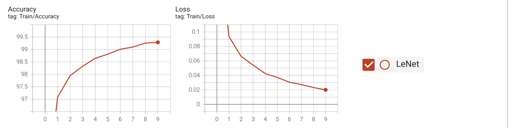
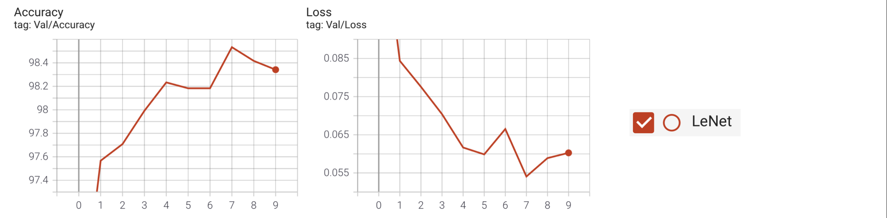
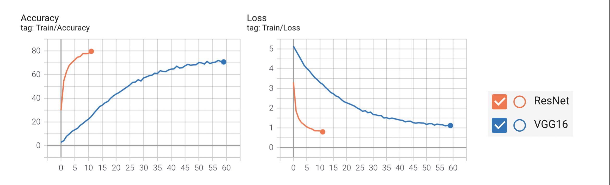
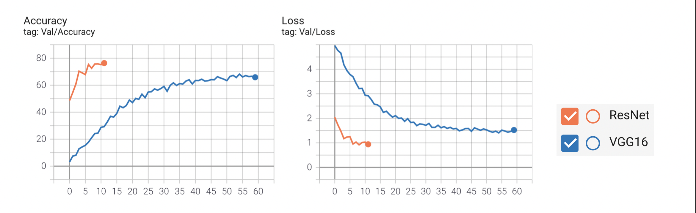

# Deep Learning Projects
This repository is a work in progress and has code implementing different deep learning tasks. Install the required packages using
```
pip install -r requirements.txt
```
### Multi-class Classification
#### 1. Example using MNIST and LeNet ([LeNet.ipynb](LeNet.ipynb))
   
   Training Metrics: Loss and Accuracy
   
   
   Validation Metrics: Loss and Accuracy
   

   
#### 2. Notebook using ResNet to classify a 150 class [Kaggle dataset](https://www.kaggle.com/thedagger/pokemon-generation-one) ([ResNet.ipynb](ResNet.ipynb)).
  
   Also experimented with [VGG](models/VGG16.py) for the same dataset. Both models were fine-tuned from a model pretrained on ImageNet. 

   Training Metrics: Loss and Accuracy
   
   
   Validation Metrics: Loss and Accuracy
   


### Language Translation using RNNs (WIP)
### Object Detection
